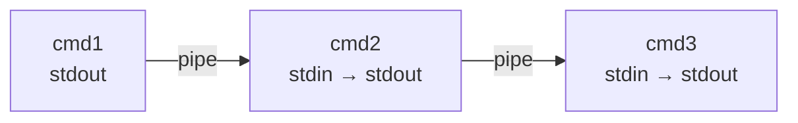

# Unix 명령어 가이드 — 기초부터 실전까지

Unix 명령어를 기초부터 실전 활용까지 정리한 가이드. 모든 명령어에 실제 실행 결과를 포함.

## 목차

1. [파일 & 디렉토리 관리](#1-파일--디렉토리-관리)
   - [1.1 파일시스템 탐색](#11-파일시스템-탐색)
   - [1.2 파일 & 디렉토리 생성](#12-파일--디렉토리-생성)
   - [1.3 복사, 이동, 삭제](#13-복사-이동-삭제)
   - [1.4 파일 내용 보기](#14-파일-내용-보기)
   - [1.5 파일 찾기](#15-파일-찾기)
   - [1.6 파일 권한](#16-파일-권한)
   - [1.7 링크](#17-링크)
   - [1.8 디스크 사용량](#18-디스크-사용량)
   - [1.9 아카이브 & 압축](#19-아카이브--압축)
   - [1.10 파일 비교](#110-파일-비교)
2. [텍스트 처리](#2-텍스트-처리)
   - [2.1 기본 텍스트 도구](#21-기본-텍스트-도구)
   - [2.2 grep — 패턴 검색](#22-grep--패턴-검색)
   - [2.3 sed — 스트림 편집기](#23-sed--스트림-편집기)
   - [2.4 awk — 패턴 스캔 & 처리](#24-awk--패턴-스캔--처리)
   - [2.5 pipe와 리다이렉션](#25-pipe와-리다이렉션)
   - [2.6 정규 표현식](#26-정규-표현식)
3. [프로세스 & 시스템 관리](#3-프로세스--시스템-관리)
   - [3.1 프로세스 확인](#31-프로세스-확인)
   - [3.2 프로세스 관리](#32-프로세스-관리)
   - [3.3 시스템 정보](#33-시스템-정보)
   - [3.4 네트워크 기초](#34-네트워크-기초)
   - [3.5 SSH & 원격 작업](#35-ssh--원격-작업)
   - [3.6 환경 변수](#36-환경-변수)
   - [3.7 작업 스케줄링](#37-작업-스케줄링)
4. [셸 스크립팅](#4-셸-스크립팅)
   - [4.1 시작하기](#41-시작하기)
   - [4.2 변수 & 파라미터 확장](#42-변수--파라미터-확장)
   - [4.3 조건문](#43-조건문)
   - [4.4 반복문](#44-반복문)
   - [4.5 함수](#45-함수)
   - [4.6 에러 처리](#46-에러-처리)
   - [4.7 실전 스크립트 예제](#47-실전-스크립트-예제)
   - [4.8 스크립트 디버깅](#48-스크립트-디버깅)
5. [흔한 실수 모음](#5-흔한-실수-모음)
6. [빠른 참조 치트시트](#빠른-참조-치트시트)
7. [일상에서 쓸 수 있는 팁](#일상에서-쓸-수-있는-팁)

---

## 1. 파일 & 디렉토리 관리

### 1.1 파일시스템 탐색

```bash
pwd                     # Print current working directory
ls                      # List files in current directory
ls -la                  # List all files (including hidden) with details
ls -lh                  # Human-readable file sizes (KB, MB, GB)
ls -lt                  # Sort by modification time (newest first)

cd /path/to/dir         # Change to specific directory
cd ..                   # Go up one level
cd -                    # Go back to previous directory
cd                      # Go to home directory
```

**실행 결과:**

```
$ pwd
/home/claude/demo_project

$ ls -la
total 26
drwxr-xr-x 5 root root 4096 Feb 16 12:51 .
drwxr-xr-x 1  999 ubuntu 4096 Feb 16 12:51 ..
-rw-r--r-- 1 root root  182 Feb 16 12:51 data.csv
drwxr-xr-x 2 root root 4096 Feb 16 12:51 docs
-rw-r--r-- 1 root root  634 Feb 16 12:51 server.log
drwxr-xr-x 2 root root 4096 Feb 16 12:51 src
drwxr-xr-x 2 root root 4096 Feb 16 12:51 tests

$ ls -lh
total 18K
-rw-r--r-- 1 root root  182 Feb 16 12:51 data.csv
drwxr-xr-x 2 root root 4.0K Feb 16 12:51 docs
-rw-r--r-- 1 root root  634 Feb 16 12:51 server.log
drwxr-xr-x 2 root root 4.0K Feb 16 12:51 src
drwxr-xr-x 2 root root 4.0K Feb 16 12:51 tests
```

### 1.2 파일 & 디렉토리 생성

```bash
touch file.txt          # Create empty file (or update timestamp)
mkdir mydir             # Create directory
mkdir -p a/b/c          # Create nested directories at once

echo "hello" > file.txt         # Write (overwrites existing)
echo "world" >> file.txt        # Append to file
cat > file.txt << EOF            # Write multi-line content
line 1
line 2
EOF
```

### 1.3 복사, 이동, 삭제

```bash
cp file.txt backup.txt          # Copy file
cp -r srcdir/ destdir/          # Copy directory recursively
cp -i file.txt dest/            # Interactive (prompt before overwrite)

mv file.txt newname.txt         # Rename file
mv file.txt /other/dir/         # Move file to another directory

rm file.txt                     # Delete file
rm -r mydir/                    # Delete directory recursively
rm -ri mydir/                   # Interactive recursive delete (safer)
rm -rf mydir/                   # Force delete without confirmation (⚠️ dangerous)
```

### 1.4 파일 내용 보기

```bash
cat file.txt                    # Print entire file
head -n 20 file.txt             # First 20 lines
tail -n 20 file.txt             # Last 20 lines
tail -f logfile.log             # Follow file in real-time (great for logs)
less file.txt                   # Scrollable viewer (q to quit)
wc -l file.txt                  # Count lines
wc -w file.txt                  # Count words
```

**실행 결과:**

```
$ cat src/index.ts
console.log('hello world');

$ head -n 3 server.log
2025-02-16 09:01:12 [INFO] Server started on port 3000
2025-02-16 09:01:13 [INFO] Connected to database
2025-02-16 09:02:45 [WARN] Slow query detected: 2340ms

$ tail -n 3 server.log
2025-02-16 09:07:00 [INFO] Cron job executed: cleanup
2025-02-16 09:08:15 [INFO] User login: admin
2025-02-16 09:09:00 [WARN] Deprecated API called: /v1/users

$ wc -l src/*.ts src/*.tsx
  1 src/index.ts
  1 src/utils.ts
  6 src/App.tsx
  8 total
```

### 1.5 파일 찾기

```bash
find . -name "*.js"                      # Find all .js files from current dir
find . -name "*.log" -mtime -7           # .log files modified in last 7 days
find . -type d -name "node_modules"      # Find directories named node_modules
find . -size +100M                       # Files larger than 100MB
find . -empty                            # Find empty files and directories
find . -newer reference.txt              # Files modified after reference.txt

find . -name "*.tmp" -delete             # Delete all .tmp files
find . -name "*.js" -exec wc -l {} +    # Count lines in all .js files

# Exclude directories from search
find . -path ./node_modules -prune -o -name "*.js" -print

which node                               # Full path of a command
whereis git                              # Locate binary, source, and man page
```

**실행 결과:**

```
$ find . -name "*.ts"
./src/index.ts
./src/utils.ts
./tests/test.ts

$ find . -name "*.tsx"
./src/App.tsx

$ find . -type d
.
./src
./docs
./tests
```

### 1.6 파일 권한

```bash
# Permission format: rwxrwxrwx (owner/group/others)
# r=4, w=2, x=1

chmod 755 script.sh         # Owner: rwx, Group: r-x, Others: r-x
chmod +x script.sh          # Add execute permission for everyone
chmod u+w file.txt          # Add write permission for owner only
chmod -R 644 ./src          # Apply recursively

chown user:group file.txt   # Change owner and group
chown -R user:group dir/    # Change ownership recursively
```

**권한 비트 분석:**

```
 -rwxr-xr-x
 │├┤├┤├┤
 │ │ │ └── others: r-x (read + execute) = 5
 │ │ └──── group:  r-x (read + execute) = 5
 │ └────── owner:  rwx (read + write + execute) = 7
 └──────── type:   - (regular file), d (directory), l (symlink)

 Common patterns:
   755 = rwxr-xr-x  (executables, scripts)
   644 = rw-r--r--  (regular files)
   700 = rwx------  (private scripts)
   600 = rw-------  (private files, SSH keys)
```

**실행 결과:**

```
$ ls -l run.sh               # Before
-rw-r--r-- 1 root root 28 Feb 16 12:52 run.sh

$ chmod +x run.sh

$ ls -l run.sh               # After: x bit added
-rwxr-xr-x 1 root root 28 Feb 16 12:52 run.sh
```

### 1.7 링크

```bash
ln -s /path/to/original symlink_name    # Create symbolic link (shortcut)
ln original hardlink_name               # Create hard link (same inode)
readlink -f symlink_name                # Resolve full path of symlink
```

### 1.8 디스크 사용량

```bash
df -h                   # Disk space usage (all mounted filesystems)
du -sh ./src             # Total size of a directory
du -sh ./* | sort -hr    # Size of each item, sorted largest first
```

**실행 결과:**

```
$ df -h
Filesystem      Size  Used Avail Use% Mounted on
none            9.9G  2.2M  9.9G   1% /
none            315G     0  315G   0% /dev

$ du -sh ./*
512     ./data.csv
4.5K    ./docs
1.0K    ./server.log
5.5K    ./src
4.5K    ./tests
```

### 1.9 아카이브 & 압축

```bash
# tar — tape archive (the standard for Unix)
tar -cf archive.tar dir/              # Create archive (no compression)
tar -czf archive.tar.gz dir/         # Create with gzip compression
tar -cjf archive.tar.bz2 dir/       # Create with bzip2 compression
tar -tf archive.tar.gz               # List contents without extracting
tar -xzf archive.tar.gz              # Extract gzipped archive
tar -xzf archive.tar.gz -C /dest/   # Extract to specific directory

# Exclude patterns
tar -czf backup.tar.gz --exclude=node_modules --exclude=.git ./project

# Compression tools (standalone)
gzip file.txt                # Compress → file.txt.gz (removes original)
gzip -k file.txt             # Compress and keep original
gunzip file.txt.gz           # Decompress
gzip -l file.txt.gz          # Show compression ratio

zip -r archive.zip dir/      # Create zip archive
unzip archive.zip             # Extract zip archive
unzip -l archive.zip          # List contents

# rsync — smart file sync (only transfers differences)
rsync -av src/ dest/                          # Local sync
rsync -av --delete src/ dest/                 # Sync and remove extra files in dest
rsync -avz src/ user@host:/path/              # Sync to remote server
rsync -av --exclude='node_modules' src/ dest/ # Sync with exclusions
```

**실행 결과:**

```
$ tar -czf project-backup.tar.gz --exclude=node_modules ./src ./docs
$ tar -tf project-backup.tar.gz
./src/
./src/index.ts
./src/utils.ts
./src/App.tsx
./docs/
./docs/README.md

$ gzip -l server.log.gz
         compressed        uncompressed  ratio uncompressed_name
                298                 634  55.5% server.log
```

### 1.10 파일 비교

```bash
diff file1.txt file2.txt              # Show differences
diff -u file1.txt file2.txt           # Unified format (most readable)
diff -r dir1/ dir2/                   # Compare directories recursively
diff -y file1.txt file2.txt           # Side-by-side comparison

# Generate and apply patches
diff -u original.txt modified.txt > changes.patch
patch original.txt < changes.patch    # Apply patch
patch -R original.txt < changes.patch # Reverse (undo) patch

# Compare sorted files
comm file1.txt file2.txt              # Three columns: only-in-1, only-in-2, both
comm -12 file1.txt file2.txt          # Lines common to both files
comm -23 file1.txt file2.txt          # Lines only in file1

# Byte-level comparison
cmp file1 file2                       # First difference only
```

**실행 결과:**

```
$ diff -u src/old.ts src/new.ts
--- src/old.ts  2025-02-16 09:00:00
+++ src/new.ts  2025-02-16 10:00:00
@@ -1,3 +1,4 @@
 import { utils } from './utils';
-const PORT = 3000;
+const PORT = process.env.PORT || 3000;
+const HOST = '0.0.0.0';
 console.log(`Listening on ${PORT}`);

$ comm <(sort list1.txt) <(sort list2.txt)
        alice
    bob
charlie
        diana
```

> `comm` 출력은 탭으로 구분된 세 개 컬럼. file1에만 있는 줄, file2에만 있는 줄, 양쪽 모두에 있는 줄 순서. 들여쓰기로 어느 컬럼에 속하는지 구분 가능.

---

## 2. 텍스트 처리

### 2.1 기본 텍스트 도구

```bash
sort data.txt                   # Sort lines alphabetically
sort -n data.txt                # Sort numerically
sort -u data.txt                # Sort and remove duplicates
sort data.txt | uniq -c         # Count occurrences of each line

cut -d',' -f1,3 data.csv       # Extract columns 1 and 3 (comma-delimited)
cut -c1-10 file.txt             # Extract first 10 characters per line

tr 'a-z' 'A-Z' < file.txt      # Convert lowercase to uppercase
tr -d '\r' < file.txt           # Remove carriage returns (Windows to Unix)
```

### 2.2 grep — 패턴 검색

```bash
grep "error" logfile.log                # Find lines containing "error"
grep -i "error" logfile.log             # Case-insensitive search
grep -r "TODO" ./src                    # Recursive search in directory
grep -n "function" app.js              # Show line numbers
grep -c "import" app.js                # Count matching lines
grep -l "useState" ./src/*.tsx          # List filenames only
grep -v "debug" logfile.log            # Invert match (exclude lines)
grep -A 3 -B 1 "error" log.txt        # Show 3 lines After, 1 Before match
grep -C 2 "error" log.txt             # 2 lines of Context (before and after)

grep -E "error|warn|fatal" log.txt     # Match any of multiple patterns (extended regex)
grep -E "^import" app.js               # Lines starting with "import"
grep -F "exact[string]" file.txt       # Fixed string match (no regex, faster)

grep -rn "console\.log" ./src --include="*.ts"
grep -rn "TODO\|FIXME" ./src
```

**실행 결과:**

```
$ grep "ERROR" server.log
2025-02-16 09:03:01 [ERROR] Failed to fetch user: timeout
2025-02-16 09:03:05 [ERROR] Connection refused: ECONNREFUSED
2025-02-16 09:06:33 [ERROR] Unhandled promise rejection

$ grep -n "WARN" server.log
3:2025-02-16 09:02:45 [WARN] Slow query detected: 2340ms
8:2025-02-16 09:05:12 [WARN] Memory usage above 80%
12:2025-02-16 09:09:00 [WARN] Deprecated API called: /v1/users

$ grep -c "INFO" server.log
6
$ grep -c "ERROR" server.log
3
$ grep -c "WARN" server.log
3

$ grep -v "INFO" server.log
2025-02-16 09:02:45 [WARN] Slow query detected: 2340ms
2025-02-16 09:03:01 [ERROR] Failed to fetch user: timeout
2025-02-16 09:03:05 [ERROR] Connection refused: ECONNREFUSED
2025-02-16 09:05:12 [WARN] Memory usage above 80%
2025-02-16 09:06:33 [ERROR] Unhandled promise rejection
2025-02-16 09:09:00 [WARN] Deprecated API called: /v1/users

$ grep -rn "TODO\|FIXME" ./src/
./src/App.tsx:1:// TODO: fix this component
./src/App.tsx:3:// FIXME: performance issue

$ grep -rn "console.log" ./src/
./src/index.ts:1:console.log('hello world');
./src/App.tsx:5:  console.log('debug');
```

### 2.3 sed — 스트림 편집기

```bash
sed 's/old/new/' file.txt               # Replace first occurrence per line
sed 's/old/new/g' file.txt              # Replace ALL occurrences (global)
sed -i 's/old/new/g' file.txt           # Edit file in-place (⚠️ modifies file)
sed -i.bak 's/old/new/g' file.txt      # In-place with backup (.bak)

sed -n '5p' file.txt                    # Print only line 5
sed -n '10,20p' file.txt               # Print lines 10 through 20
sed '3d' file.txt                       # Delete line 3
sed '/^#/d' file.txt                    # Delete lines starting with #
sed '/^$/d' file.txt                    # Delete empty lines

sed '3i\New line here' file.txt         # Insert before line 3
sed '3a\New line here' file.txt         # Append after line 3
sed -e 's/foo/bar/g' -e 's/baz/qux/g' file.txt   # Multiple operations

sed 's/http:\/\//https:\/\//g' urls.txt         # HTTP to HTTPS
sed -n '/START/,/END/p' config.txt              # Print between markers
sed 's/^/  /' file.txt                           # Add 2-space indent
```

> **BSD sed vs GNU sed:** macOS에는 BSD sed가 들어 있어서 `sed -i '' 's/...'`처럼 `-i` 뒤에 빈 문자열 인자가 필요함. Linux의 GNU sed는 `sed -i 's/...'`로 바로 쓸 수 있음.

**실행 결과:**

```
$ cat src/index.ts
console.log('hello world');

$ sed 's/hello/goodbye/' src/index.ts
console.log('goodbye world');

$ sed -n '5p' server.log
2025-02-16 09:03:02 [INFO] Retrying request...

$ sed -n '3,6p' server.log
2025-02-16 09:02:45 [WARN] Slow query detected: 2340ms
2025-02-16 09:03:01 [ERROR] Failed to fetch user: timeout
2025-02-16 09:03:02 [INFO] Retrying request...
2025-02-16 09:03:05 [ERROR] Connection refused: ECONNREFUSED

$ sed '/^\/\//d' src/App.tsx
import React from 'react';
export default function App() {
  console.log('debug');
  return <div>Hello</div>;
}

$ sed 's/^/    /' src/utils.ts
    export function add(a, b) { return a + b; }
```

### 2.4 awk — 패턴 스캔 & 처리

```bash
awk '{print $1}' file.txt               # First column
awk '{print $1, $3}' file.txt           # First and third columns
awk '{print NR, $0}' file.txt           # Line number + entire line

awk -F',' '{print $2}' data.csv         # Second column of CSV
awk -F':' '{print $1}' /etc/passwd      # Usernames from passwd

awk '$3 > 100' data.txt                 # Lines where column 3 > 100
awk '/error/' logfile.log               # Lines containing "error"

awk '{sum += $1} END {print sum}' nums.txt              # Sum
awk '{sum += $1; count++} END {print sum/count}' data    # Average
awk 'BEGIN {max=0} $1>max {max=$1} END {print max}'      # Max

awk -F',' '{printf "%-20s %10d\n", $1, $2}' data.csv    # Formatted
```

**실행 결과:**

```
$ cat data.csv
name,age,role,salary
Alice,28,frontend,85000
Bob,35,backend,92000
Charlie,42,devops,98000
Diana,31,frontend,88000
Eve,26,intern,45000
Frank,38,backend,95000
Grace,29,fullstack,90000

$ awk -F',' '{print $1, $3}' data.csv
name role
Alice frontend
Bob backend
Charlie devops
Diana frontend
Eve intern
Frank backend
Grace fullstack

$ awk -F',' 'NR>1 && $4 > 90000 {print $1, $3, "$"$4}' data.csv
Bob backend $92000
Charlie devops $98000
Frank backend $95000

$ awk -F',' '$3 == "frontend" {print $1, "$"$4}' data.csv
Alice $85000
Diana $88000

$ awk -F',' 'NR>1 {sum+=$4; count++} END {printf "Average: $%d (%d people)\n", sum/count, count}' data.csv
Average: $84714 (7 people)

$ awk -F'[][]' '{print $2}' server.log | sort | uniq -c | sort -rn
      6 INFO
      3 WARN
      3 ERROR

$ awk -F',' 'NR>1 {printf "%-10s | %-10s | $%6d\n", $1, $3, $4}' data.csv
Alice      | frontend   | $ 85000
Bob        | backend    | $ 92000
Charlie    | devops     | $ 98000
Diana      | frontend   | $ 88000
Eve        | intern     | $ 45000
Frank      | backend    | $ 95000
Grace      | fullstack  | $ 90000
```

### 2.5 pipe와 리다이렉션

**pipe 동작 원리:**



```bash
ls -la | grep ".js" | wc -l            # Count .js files

command > file.txt          # Redirect stdout (overwrite)
command >> file.txt         # Redirect stdout (append)
command 2> error.log        # Redirect stderr
command > out.txt 2>&1      # Redirect both stdout and stderr
command &> all.log          # Shorthand for both (bash)

command > /dev/null 2>&1    # Silence all output

command | tee output.txt            # Display and save
command | tee -a output.txt         # Display and append
```

**파일 디스크립터:**

```
┌──────────────────────────────────────────┐
│  FD 0 (stdin)  ← keyboard / pipe / file  │
│  FD 1 (stdout) → terminal / pipe / file  │
│  FD 2 (stderr) → terminal / file         │
└──────────────────────────────────────────┘

 cmd > file        # FD 1 → file
 cmd 2> file       # FD 2 → file
 cmd > file 2>&1   # FD 1 → file, then FD 2 → wherever FD 1 goes (= file)
 cmd 2>&1 | next   # Both FD 1 and FD 2 piped to next command
```

**xargs — stdin으로 명령어 만들기:**

```bash
find . -name "*.log" | xargs rm             # Delete found files
find . -name "*.ts" | xargs grep "TODO"     # Search in found files

# ⚠️ 공백이나 특수 문자가 포함된 파일명에도 안전한 xargs
find . -name "*.log" -print0 | xargs -0 rm          # Null-delimited (safe)
find . -name "*.ts" -print0 | xargs -0 grep "TODO"

# Custom placeholder
find . -name "*.bak" | xargs -I {} mv {} /backup/    # Move each file
```

> **왜 `-print0 | xargs -0`인가?** 기본적으로 `xargs`는 공백 기준으로 인자를 나눔. `my file.log` 같은 파일명이 `my`와 `file.log` 두 개로 분리됨. null 바이트를 구분자로 쓰면 이 문제를 피할 수 있음.

**실행 결과:**

```
$ grep "ERROR" server.log | awk '{print $2}'
09:03:01
09:03:05
09:06:33

$ find . -name "*.ts" -o -name "*.tsx" | xargs wc -l | sort -rn
  9 total
  6 ./src/App.tsx
  1 ./tests/test.ts
  1 ./src/utils.ts
  1 ./src/index.ts

$ awk -F',' 'NR>1 {print $3}' data.csv | sort | uniq -c | sort -rn
      2 frontend
      2 backend
      1 intern
      1 fullstack
      1 devops

$ grep "ERROR" server.log > errors_only.txt
$ cat errors_only.txt
2025-02-16 09:03:01 [ERROR] Failed to fetch user: timeout
2025-02-16 09:03:05 [ERROR] Connection refused: ECONNREFUSED
2025-02-16 09:06:33 [ERROR] Unhandled promise rejection

$ grep "WARN" server.log | tee warnings.txt
2025-02-16 09:02:45 [WARN] Slow query detected: 2340ms
2025-02-16 09:05:12 [WARN] Memory usage above 80%
2025-02-16 09:09:00 [WARN] Deprecated API called: /v1/users

$ find . -name "*.ts" -o -name "*.tsx" | xargs grep -n "import"
./src/App.tsx:2:import React from 'react';
./tests/test.ts:1:import { add } from '../src/utils';
```

### 2.6 정규 표현식

`grep`, `sed`, `awk`, `find` 등 대부분의 Unix 도구에서 사용 가능.

**메타 문자:**

| 기호 | 의미 | 예시 | 매칭 결과 |
|------|------|------|-----------|
| `.` | 아무 문자 하나 | `h.t` | hat, hot, hit |
| `*` | 앞 문자가 0회 이상 | `ab*c` | ac, abc, abbc |
| `+` | 앞 문자가 1회 이상 (확장) | `ab+c` | abc, abbc (ac은 안 됨) |
| `?` | 앞 문자가 0회 또는 1회 (확장) | `colou?r` | color, colour |
| `^` | 줄의 시작 | `^import` | "import"로 시작하는 줄 |
| `$` | 줄의 끝 | `\.js$` | ".js"로 끝나는 줄 |
| `[]` | 문자 클래스 | `[aeiou]` | 모음 하나 |
| `[^]` | 부정 클래스 | `[^0-9]` | 숫자가 아닌 문자 |
| `\b` | 단어 경계 | `\berror\b` | "error"만 (errors는 안 됨) |
| `\d` | 숫자 (grep -P) | `\d{3}` | 숫자 세 자리 |
| `()` | 그룹 (확장) | `(ab)+` | ab, abab, ababab |
| `\|` | 또는 (기본) / `|` (확장) | `cat\|dog` | cat 또는 dog |

**기본 정규식 vs 확장 정규식:**

```bash
# Basic regex (grep, sed) — escape +, ?, |, (), {}
grep 'error\|warn' log.txt
sed 's/\(old\)/[\1]/g' file.txt

# Extended regex (grep -E, sed -E, awk) — no escaping needed
grep -E 'error|warn' log.txt
sed -E 's/(old)/[\1]/g' file.txt
```

**자주 쓰는 패턴:**

```bash
grep -E '^[0-9]{4}-[0-9]{2}-[0-9]{2}' log.txt     # Date YYYY-MM-DD
grep -E '[a-zA-Z0-9._%+-]+@[a-zA-Z0-9.-]+\.[a-zA-Z]{2,}' file.txt  # Email
grep -E '^https?://' urls.txt                        # HTTP/HTTPS URLs
grep -E '([0-9]{1,3}\.){3}[0-9]{1,3}' log.txt      # IPv4 address
grep -E '^\s*$' file.txt                             # Blank lines (empty or whitespace)
```

---

## 3. 프로세스 & 시스템 관리

### 3.1 프로세스 확인

```bash
ps                          # Current user's processes
ps aux                      # All processes with details
ps aux | grep node          # Find node processes
ps -ef --forest             # Process tree view

top                         # Real-time process monitor (q to quit)
htop                        # Better interactive process viewer (if installed)

pgrep -f "node"             # Find PID by process name
pidof nginx                 # Get PID of a running program
```

**실행 결과:**

```
$ ps aux | head -5
USER       PID %CPU %MEM    VSZ   RSS TTY      STAT START   TIME COMMAND
root         1  1.3  0.2 487868 22636 ?        Ssl  12:51   0:01 /process_api ...
root        89 50.0  0.0  10848  2844 ?        S    12:53   0:00 /bin/sh ...
root        90  100  0.0  15996  7392 ?        R    12:53   0:00 ps aux
```

### 3.2 프로세스 관리

```bash
command &                           # Run command in background
nohup command &                     # Run even after terminal closes
nohup command > output.log 2>&1 &   # Background with logging

jobs                        # List background jobs
fg %1                       # Bring job 1 to foreground
bg %1                       # Send job 1 to background
Ctrl+Z                      # Suspend current foreground process
Ctrl+C                      # Terminate current foreground process

kill PID                    # Send SIGTERM (graceful shutdown)
kill -9 PID                 # Send SIGKILL (force kill)
killall node                # Kill all processes by name
pkill -f "node server"      # Kill by pattern match
```

**실행 결과:**

```
$ sleep 300 &
[1] 95

$ ps aux | grep "sleep 300" | grep -v grep
root        95 25.0  0.0  10744  3432 ?        S    12:53   0:00 sleep 300

$ kill 95
[1]+  Terminated              sleep 300
```

### 3.3 시스템 정보

```bash
uname -a                    # System info (kernel, architecture)
hostname                    # Machine hostname
uptime                      # How long system has been running
whoami                      # Current username
id                          # User ID, group ID, groups

free -h                     # Memory usage (human-readable)
lscpu                       # CPU information
lsblk                       # Block devices (disks)
```

**실행 결과:**

```
$ uname -a
Linux runsc 4.4.0 #1 SMP Sun Jan 10 15:06:54 PST 2016 x86_64 GNU/Linux

$ whoami
root

$ uptime
 12:53:06 up 1 min,  0 user,  load average: 0.00, 0.00, 0.00

$ free -h
               total        used        free      shared  buff/cache   available
Mem:           9.0Gi        13Mi       9.0Gi          0B       8.3Mi       9.0Gi
Swap:             0B          0B          0B
```

### 3.4 네트워크 기초

```bash
curl https://example.com                  # Fetch URL content
curl -o file.zip https://example.com/f    # Download to file
curl -I https://example.com              # Headers only
curl -X POST -d '{"key":"val"}' -H 'Content-Type: application/json' URL

wget https://example.com/file.zip        # Download file
wget -q -O - URL                         # Download to stdout (quiet)

ping google.com             # Test connectivity
ping -c 4 google.com        # Send exactly 4 pings then stop
netstat -tlnp               # List listening ports
ss -tlnp                    # Modern alternative to netstat
lsof -i :3000               # What process is using port 3000
```

### 3.5 SSH & 원격 작업

```bash
# Connect to remote server
ssh user@hostname                        # Basic connection
ssh -p 2222 user@hostname                # Custom port
ssh -i ~/.ssh/mykey.pem user@hostname    # Specific key file

# Run a command on remote without opening a shell
ssh user@host "ls -la /var/log"
ssh user@host "cat /etc/nginx/nginx.conf" > local-copy.conf

# Key management
ssh-keygen -t ed25519 -C "your@email.com"   # Generate key pair (recommended type)
ssh-copy-id user@hostname                    # Copy public key to server
ssh-add ~/.ssh/id_ed25519                    # Add key to SSH agent

# Secure copy (scp)
scp file.txt user@host:/path/              # Local → remote
scp user@host:/path/file.txt ./            # Remote → local
scp -r ./dir user@host:/path/             # Copy directory recursively

# Port forwarding
ssh -L 8080:localhost:3000 user@host       # Local forwarding (access remote:3000 at localhost:8080)
ssh -R 9090:localhost:3000 user@host       # Remote forwarding (expose local:3000 on remote:9090)

# rsync over SSH (preferred over scp for large/repeated transfers)
rsync -avz -e ssh ./project/ user@host:/path/
rsync -avz --exclude='node_modules' -e ssh ./project/ user@host:/path/
```

> **scp vs rsync:** `scp`는 매번 전체를 복사함. `rsync`는 변경된 부분만 전송. 반복 전송이나 큰 디렉토리에는 항상 `rsync`가 나음.

### 3.6 환경 변수

```bash
echo $PATH                  # Print PATH variable
echo $HOME                  # Home directory
env                         # List all environment variables
export MY_VAR="value"       # Set variable for current session
unset MY_VAR                # Remove variable

echo 'export MY_VAR="value"' >> ~/.bashrc
source ~/.bashrc            # Reload config
```

### 3.7 작업 스케줄링

```bash
crontab -l                  # List current cron jobs
crontab -e                  # Edit cron jobs

# Cron format: minute hour day_of_month month day_of_week command
# ┌───── minute (0-59)
# │ ┌───── hour (0-23)
# │ │ ┌───── day of month (1-31)
# │ │ │ ┌───── month (1-12)
# │ │ │ │ ┌───── day of week (0-6, Sunday=0)
# │ │ │ │ │
# * * * * * command

0 9 * * *     /path/script.sh      # Every day at 9:00 AM
*/5 * * * *   /path/script.sh      # Every 5 minutes
0 0 * * 0     /path/backup.sh      # Every Sunday at midnight
30 8 1 * *    /path/report.sh      # 1st of every month at 8:30 AM

# Special strings (shortcuts)
@reboot       /path/startup.sh     # Run once at boot
@daily        /path/cleanup.sh     # Same as 0 0 * * *
@hourly       /path/check.sh       # Same as 0 * * * *
@weekly       /path/report.sh      # Same as 0 0 * * 0
@yearly       /path/audit.sh       # Same as 0 0 1 1 *
```

**cron 사용 시 자주 빠지는 함정:**

```bash
# ⚠️ Cron runs with a minimal PATH — use full paths for commands
# WRONG
* * * * * node /app/script.js

# CORRECT
* * * * * /usr/local/bin/node /app/script.js

# ⚠️ Capture output for debugging — cron failures are silent by default
*/5 * * * * /path/script.sh >> /var/log/myscript.log 2>&1

# ⚠️ Environment variables from your shell profile are NOT available in cron
# Set them explicitly at the top of crontab
PATH=/usr/local/bin:/usr/bin:/bin
NODE_ENV=production
```

---

## 4. 셸 스크립팅

### 4.1 시작하기

```bash
#!/bin/bash
# The shebang (first line) tells the system which interpreter to use

chmod +x script.sh      # Make script executable
./script.sh             # Run script
bash script.sh          # Alternative way to run
```

### 4.2 변수 & 파라미터 확장

```bash
#!/bin/bash

name="Claude"
count=42

echo "Hello, $name"
echo "Count is ${count} items"

# Command substitution
today=$(date +%Y-%m-%d)
file_count=$(ls | wc -l)

# Read user input
read -p "Enter your name: " username
echo "Hello, $username"

# Special variables
echo $0          # Script name
echo $1          # First argument
echo $#          # Number of arguments
echo $@          # All arguments
echo $?          # Exit status of last command
echo $$          # Current process ID
```

**파라미터 확장 — 외부 명령 없이 변수를 가공하는 방법:**

```bash
file="src/components/Header.tsx"

# Substrings & removal
${file%.tsx}           # src/components/Header     (remove shortest suffix match)
${file%%/*}            # src                       (remove longest suffix match)
${file#*/}             # components/Header.tsx     (remove shortest prefix match)
${file##*/}            # Header.tsx                (remove longest prefix match — like basename)

# Substitution
${file/src/lib}        # lib/components/Header.tsx (replace first match)
${file//o/0}           # src/c0mp0nents/Header.tsx (replace all matches)

# Default values
${PORT:-3000}          # Use 3000 if PORT is unset or empty
${PORT:=3000}          # Same, but also assign 3000 to PORT
${PORT:?"PORT is required"}  # Exit with error if PORT is unset

# Length
${#file}               # 26 (character count)

# Case conversion (bash 4+)
name="hello world"
${name^}               # Hello world (capitalize first)
${name^^}              # HELLO WORLD (all uppercase)
${name,,}              # hello world (all lowercase)
```

**실행 결과:**

```
$ name="hyukho"
$ today=$(date +%Y-%m-%d)
$ file_count=$(find ./src -type f | wc -l)
$ echo "Hello, $name! Today is ${today}, src has ${file_count} files."
Hello, hyukho! Today is 2026-02-16, src has 3 files.

$ path="/home/user/docs/report.pdf"
$ echo "Directory: ${path%/*}"
Directory: /home/user/docs
$ echo "Filename: ${path##*/}"
Filename: report.pdf
$ echo "No extension: ${path%.pdf}"
No extension: /home/user/docs/report
```

### 4.3 조건문

```bash
#!/bin/bash

if [ "$1" = "start" ]; then
    echo "Starting..."
elif [ "$1" = "stop" ]; then
    echo "Stopping..."
else
    echo "Usage: $0 {start|stop}"
    exit 1
fi

# Numeric: -eq -ne -gt -lt -ge -le
if [ "$count" -gt 10 ]; then
    echo "More than 10"
fi

# String tests
if [ -z "$var" ]; then echo "Empty"; fi
if [ -n "$var" ]; then echo "Not empty"; fi

# File tests
if [ -f "file.txt" ]; then echo "File exists"; fi
if [ -d "mydir" ]; then echo "Directory exists"; fi
if [ -x "script.sh" ]; then echo "Executable"; fi

# Logical operators
if [ "$a" -gt 0 ] && [ "$a" -lt 100 ]; then
    echo "Between 1 and 99"
fi

# Modern [[ ]] syntax (bash-specific)
if [[ "$name" == *"pattern"* ]]; then
    echo "Contains pattern"
fi
```

**실행 결과:**

```
$ if [ -f "server.log" ]; then echo "server.log exists"; else echo "not found"; fi
server.log exists

$ error_count=$(grep -c "ERROR" server.log)
$ if [ "$error_count" -gt 2 ]; then
>     echo "⚠️ $error_count errors found! Check needed."
> fi
⚠️ 3 errors found! Check needed.
```

### 4.4 반복문

```bash
#!/bin/bash

# for — iterate over list
for item in apple banana cherry; do
    echo "Fruit: $item"
done

# for — iterate over files
for file in *.js; do
    echo "Processing $file"
done

# for — C-style
for ((i = 0; i < 5; i++)); do
    echo "Index: $i"
done

# for — range
for i in {1..10}; do
    echo "Number: $i"
done

# while
count=0
while [ $count -lt 5 ]; do
    echo "Count: $count"
    ((count++))
done

# while — read file line by line
while IFS= read -r line; do
    echo "Line: $line"
done < input.txt

# break and continue
for i in {1..10}; do
    [ $i -eq 3 ] && continue   # Skip 3
    [ $i -eq 8 ] && break      # Stop at 8
    echo $i
done
```

**실행 결과:**

```
$ for file in src/*; do
>     lines=$(wc -l < "$file")
>     echo "$file: ${lines} lines"
> done
src/App.tsx: 6 lines
src/index.ts: 1 lines
src/utils.ts: 1 lines

$ grep "ERROR" server.log | while IFS= read -r line; do
>     time=$(echo "$line" | awk '{print $2}')
>     msg=$(echo "$line" | sed 's/.*\] //')
>     echo "  Time: $time | Msg: $msg"
> done
  Time: 09:03:01 | Msg: Failed to fetch user: timeout
  Time: 09:03:05 | Msg: Connection refused: ECONNREFUSED
  Time: 09:06:33 | Msg: Unhandled promise rejection
```

### 4.5 함수

```bash
#!/bin/bash

greet() {
    local name=$1
    echo "Hello, $name!"
}
greet "World"

is_file() {
    [ -f "$1" ] && return 0 || return 1
}

if is_file "test.txt"; then
    echo "File exists"
fi

get_timestamp() {
    echo $(date +%Y%m%d_%H%M%S)
}
backup_name="backup_$(get_timestamp).tar.gz"
```

**실행 결과:**

```
$ analyze_log() {
>     local logfile=$1
>     local level=$2
>     local count=$(grep -c "$level" "$logfile" 2>/dev/null || echo 0)
>     echo "[$level] $count entries"
> }

$ analyze_log server.log "INFO"
[INFO] 6 entries
$ analyze_log server.log "WARN"
[WARN] 3 entries
$ analyze_log server.log "ERROR"
[ERROR] 3 entries
```

### 4.6 에러 처리

```bash
#!/bin/bash

set -e              # Script stops if any command fails
set -u              # Treat unset variables as errors
set -o pipefail     # Pipe fails if any command in pipe fails
set -euo pipefail   # Combined (recommended)

# Trap — run cleanup on exit or error
cleanup() {
    echo "Cleaning up temp files..."
    rm -f /tmp/myapp_*
}
trap cleanup EXIT
trap cleanup ERR

# Check command exists
if ! command -v node &> /dev/null; then
    echo "Error: node is not installed" >&2
    exit 1
fi

# Default values
name=${1:-"default_name"}
```

> **`set -e` 주의할 점:** `if` 조건이나 `||`, `&&` 체인 안의 명령은 실패해도 스크립트가 종료되지 않음. 의도된 동작. 의도적으로 실패를 무시하려면 `|| true`를 붙이면 됨: `grep "maybe" file.txt || true`

### 4.7 실전 스크립트 예제

#### 예제 1: 프로젝트 셋업 스크립트

```bash
#!/bin/bash
set -euo pipefail

PROJECT_NAME=${1:?"Usage: $0 <project-name>"}

echo "Creating project: $PROJECT_NAME"

mkdir -p "$PROJECT_NAME"/{src,tests,docs}
touch "$PROJECT_NAME"/src/index.ts
touch "$PROJECT_NAME"/README.md

cat > "$PROJECT_NAME/package.json" << EOF
{
  "name": "$PROJECT_NAME",
  "version": "1.0.0",
  "main": "src/index.ts"
}
EOF

echo "Project $PROJECT_NAME created successfully!"
```

#### 예제 2: 로그 분석기

```bash
#!/bin/bash
set -euo pipefail

LOGFILE=${1:?"Usage: $0 <logfile>"}

if [ ! -f "$LOGFILE" ]; then
    echo "Error: $LOGFILE not found" >&2
    exit 1
fi

echo "=== Log Analysis: $LOGFILE ==="
total=$(wc -l < "$LOGFILE")
errors=$(grep -c -i "error" "$LOGFILE" || true)
warnings=$(grep -c -i "warn" "$LOGFILE" || true)

echo "Total lines:  $total"
echo "Errors:       $errors"
echo "Warnings:     $warnings"

if [ "$errors" -gt 0 ]; then
    echo ""
    echo "=== Last 5 Errors ==="
    grep -i "error" "$LOGFILE" | tail -5
fi
```

#### 예제 3: 프로젝트 리포트 생성기

```bash
#!/bin/bash
set -euo pipefail

PROJECT_DIR=${1:-.}
PROJECT_NAME=$(basename "$(cd "$PROJECT_DIR" && pwd)")
DATE=$(date '+%Y-%m-%d %H:%M:%S')

echo "============================================"
echo "  PROJECT REPORT: $PROJECT_NAME"
echo "  Generated: $DATE"
echo "============================================"

# File statistics
echo ""
echo "[File Statistics]"
total=$(find "$PROJECT_DIR" -type f | wc -l | tr -d ' ')
echo "  Total files: $total"

for ext in ts tsx csv log md sh; do
    count=$(find "$PROJECT_DIR" -name "*.$ext" -type f | wc -l | tr -d ' ')
    if [ "$count" -gt 0 ]; then
        echo "  .$ext files: $count"
    fi
done

# Code quality indicators
echo ""
echo "[Code Quality]"
todo=$(grep -rn "TODO\|FIXME" "$PROJECT_DIR/src" 2>/dev/null | wc -l | tr -d ' ')
logs=$(grep -rn "console.log" "$PROJECT_DIR/src" 2>/dev/null | wc -l | tr -d ' ')
echo "  TODO/FIXME: $todo"
echo "  console.log: $logs"

# Log summary (if server.log exists)
if [ -f "$PROJECT_DIR/server.log" ]; then
    echo ""
    echo "[Log Summary]"
    for level in INFO WARN ERROR; do
        count=$(grep -c "$level" "$PROJECT_DIR/server.log" || true)
        echo "  $level: $count"
    done
fi

echo ""
echo "============================================"
echo "  Report complete!"
echo "============================================"
```

**실행 결과:**

```
============================================
  PROJECT REPORT: demo_project
  Generated: 2026-02-16 12:53:31
============================================

[File Statistics]
  Total files: 8
  .ts files: 3
  .tsx files: 1
  .csv files: 1
  .log files: 1
  .md files: 1
  .sh files: 1

[Code Quality]
  TODO/FIXME: 2
  console.log: 2

[Log Summary]
  INFO: 6
  WARN: 3
  ERROR: 3

============================================
  Report complete!
============================================
```

### 4.8 스크립트 디버깅

```bash
#!/bin/bash

# Trace mode — prints each command before executing
set -x          # Enable trace
set +x          # Disable trace

# Syntax check without executing
bash -n script.sh

# Run with trace from command line (don't modify the script)
bash -x script.sh

# Trace only a specific section
set -x
some_complex_function "$arg1" "$arg2"
set +x

# Debug with custom prefix (shows line numbers)
export PS4='+ ${BASH_SOURCE}:${LINENO}: '
set -x
```

**실행 결과:**

```
$ bash -x analyze.sh server.log
+ set -euo pipefail
+ LOGFILE=server.log
+ '[' '!' -f server.log ']'
+ wc -l
+ total=12
+ grep -c -i error server.log
+ errors=3
+ echo 'Total lines:  12'
Total lines:  12
+ echo 'Errors:       3'
Errors:       3
```

> `set -x`는 셸 스크립트 디버깅에서 가장 유용한 도구. 뭔가 안 될 때 문제 구간 앞에 `set -x`를 넣고 트레이스 출력을 읽어볼 것.

---

## 5. 흔한 실수 모음

누구나 한 번쯤 겪는 실수 모음.

### 따옴표 처리

```bash
# ⚠️ Unquoted variables break on spaces
file="my document.txt"
cat $file        # Tries to open "my" and "document.txt" — WRONG
cat "$file"      # Opens "my document.txt" — CORRECT

# Rule of thumb: always double-quote variables
for f in "$@"; do echo "$f"; done     # CORRECT — preserves arguments
for f in $@; do echo "$f"; done       # WRONG — splits on spaces
```

### glob 확장

```bash
# ⚠️ Globs that match nothing behave differently across shells
ls *.xyz         # If no .xyz files: error (or literal "*.xyz" depending on shell)

# Safe pattern: check first or use nullglob
shopt -s nullglob    # bash: unmatched globs expand to nothing
for f in *.xyz; do echo "$f"; done   # Safe — loop body just doesn't execute
```

### rm의 위험성

```bash
# ⚠️ Variable expansion + rm = potential disaster
dir=""
rm -rf "$dir/"       # Expands to rm -rf / — deletes everything

# Safer pattern: validate before deleting
[ -z "$dir" ] && { echo "dir is empty, aborting"; exit 1; }
rm -rf "$dir/"
```

### 파이프라인 변수 스코프

```bash
# ⚠️ Pipes run in subshells — variables set inside don't propagate
count=0
cat file.txt | while read line; do
    ((count++))          # This count lives in a subshell
done
echo "$count"            # Still 0!

# Fix: use process substitution or here-string
count=0
while read line; do
    ((count++))
done < file.txt
echo "$count"            # Correct count
```

### 정수 비교 vs 문자열 비교

```bash
# ⚠️ Using wrong comparison operator
[ "10" > "9" ]     # String comparison: "1" < "9", so this is FALSE
[ 10 -gt 9 ]       # Numeric comparison: 10 > 9, TRUE

# [ ] uses:  =, !=             for strings
#            -eq, -ne, -gt...   for numbers
# [[ ]] uses: ==, !=           for strings (with glob support)
#             -eq, -ne, -gt...  for numbers
```

### 파이프에서 조용히 실패하는 경우

```bash
# ⚠️ Without pipefail, only the LAST command's exit code matters
false | true
echo $?      # 0 — the pipe "succeeded" even though false failed

set -o pipefail
false | true
echo $?      # 1 — now it catches the failure
```

---

## 빠른 참조 치트시트

| 분류 | 명령어 | 설명 |
|------|--------|------|
| **탐색** | `cd`, `pwd`, `ls -la` | 이동하고 현재 위치 확인 |
| **생성** | `touch`, `mkdir -p`, `echo >` | 파일과 디렉토리 만들기 |
| **복사/이동** | `cp -r`, `mv`, `rm -r` | 복사, 이동, 삭제 |
| **보기** | `cat`, `head`, `tail -f`, `less` | 파일 내용 읽기 |
| **파일 찾기** | `find . -name`, `which` | 이름이나 경로로 파일 찾기 |
| **내용 검색** | `grep -rn`, `grep -E` | 파일 안에서 텍스트 찾기 |
| **변환** | `sed 's/a/b/g'`, `awk '{print $1}'` | 텍스트 편집과 추출 |
| **정렬/카운트** | `sort`, `uniq -c`, `wc -l` | 정렬하고 세기 |
| **비교** | `diff -u`, `comm`, `cmp` | 파일 비교 |
| **아카이브** | `tar -czf`, `tar -xzf`, `zip` | 압축과 해제 |
| **동기화** | `rsync -avz`, `scp` | 파일 전송과 동기화 |
| **프로세스** | `ps aux`, `kill`, `top`, `htop` | 실행 중인 프로세스 관리 |
| **디스크** | `df -h`, `du -sh` | 디스크 사용량 확인 |
| **네트워크** | `curl`, `ping`, `ss -tlnp` | 네트워크 작업 |
| **원격** | `ssh`, `scp`, `rsync -e ssh` | 원격 서버 작업 |
| **권한** | `chmod`, `chown` | 파일 접근 제어 |
| **파이프** | `cmd1 \| cmd2`, `>`, `>>`, `tee` | 명령어 연결 |
| **스케줄** | `crontab -e`, `@daily` | 반복 작업 자동화 |
| **디버그** | `set -x`, `bash -n` | 트레이스와 문법 검사 |

---

## 일상에서 쓸 수 있는 팁

**`man`과 `--help`를 자주 쓸 것.** 옵션이 기억 안 날 때 `man grep`이나 `grep --help`가 제일 빠름.

**복잡한 명령은 점진적으로 만들 것.** 간단한 것부터 시작해서 pipe를 하나씩 추가하고, 매 단계마다 결과를 확인하면서 넘어감.

**`history`와 `Ctrl+R` 활용.** 이전에 쓴 명령을 다시 타이핑하지 말고 검색. `history | grep "docker"`로 과거 docker 명령을 찾을 수도 있음.

**자주 쓰는 명령에 alias를 만들어 둘 것.** `~/.bashrc`나 `~/.zshrc`에 추가:
```bash
alias ll='ls -la'
alias gs='git status'
alias gd='git diff'
alias dc='docker compose'
```

**`!!`과 `!$` 단축키.** `sudo !!`는 직전 명령을 sudo로 다시 실행. `!$`는 마지막 인자를 재사용.

**`xargs -0`을 써야 할 때.** 파일명에 공백이나 특수 문자가 들어갈 수 있으면 `find | xargs` 대신 `find -print0 | xargs -0` 사용.

**변수에는 따옴표.** `"$var"`가 거의 항상 맞는 형태. 따옴표 없는 `$var`는 공백에서 쪼개지고 glob이 확장돼서 스크립트 버그의 흔한 원인.
